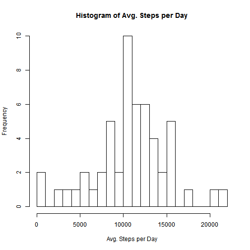
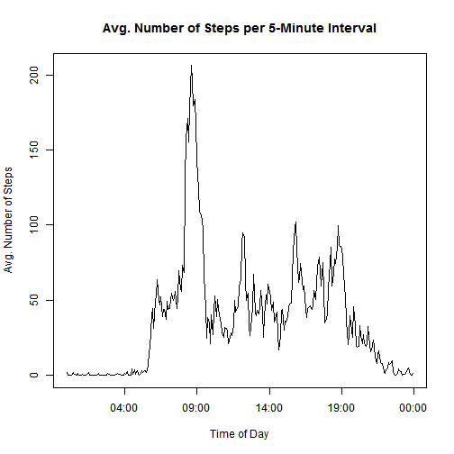
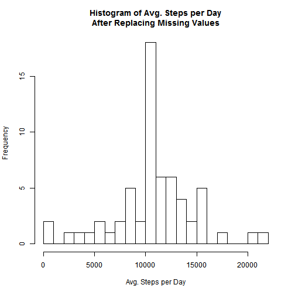
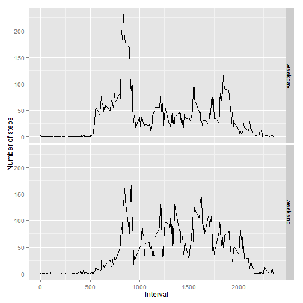

# Reproducible Research: Peer Assessment 1


## Loading and preprocessing the data


```r
# Imports data file
data <- read.csv("./activity.csv")
```

## What is mean total number of steps taken per day?


```r
# Creates a data frame with number of steps per day
dsum <- as.matrix(
    with(data,
        tapply(steps,
               date,
               sum)))

# Generates a histogram of the previously created data frame
hist(dsum,
     breaks = 20,
     main = "Histogram of Avg. Steps per Day",
     xlab = "Avg. Steps per Day")
```

 

```r
# Calculates and stores the mean and median of steps per day
stepMean <- round(
    mean(dsum, na.rm=TRUE)
    , 2)
stepMedian <- median(dsum, na.rm=TRUE)

# Forces the mean to not be printed in scientific notation
options(scipen=999)
```

The mean number of steps taken per day is 10766.19.  
The median number of steps taken per day is 10765.

## What is the average daily activity pattern?


```r
require(plyr)
# Creates a data frame with the average number of steps per interval
sumInt <- ddply(data,
                .(interval),
                summarise,
                    totSteps = round(sum(steps, na.rm = TRUE),2),
                    meanSteps = round(mean(steps, na.rm = TRUE), 2))

# Transforms interval into time of day
sumInt[,4] <- as.POSIXct(
    strptime(
        sprintf("%04d", sumInt[,1]),"%H%M"))

# Plots a time series of the average number of steps per 5-minute interval 
with(sumInt,
     plot(V4,
          meanSteps,
          type = "l",
          main = "Avg. Number of Steps per 5-Minute Interval",
          xlab = "Time of Day",
          ylab = "Avg. Number of Steps"))
```

 


```r
# Finds and stores the interval with the most average steps
intMax <- strftime(sumInt[order(sumInt$meanSteps,decreasing=TRUE),][1,4],
         format="%H:%M")
```

The 5-minute interval with the maximum average number of steps is 08:35.

## Inputing missing values


```r
# Calculates and stores the number of rows with missing values
sumNA <- sum(!complete.cases(data))
```

The number of rows with missing values is 2304

For the missing values, I substituted the mean steps for the interval in which the missing value occured.  
For example, if the missing value occured at interval 1005, I substituted the missing value with the mean steps for interval 1005.  
To do this. I subsetted out the rows in the data with NA values in to a new dataframe. I replaced the missing values with the mean steps and then reinsert the rows back into the original dataframe.


```r
# Creates a data frame of the rows with missing values
NAtemp <- subset(data, is.na(steps) == TRUE)

# Creates a data frame of the rows with complete cases
newData <- subset(data, is.na(steps) == FALSE)

# Substitues the missing values with the average steps of the corresponding interval
NAtemp$steps <- sumInt$meanSteps[match(NAtemp$interval,
                                       sumInt$interval)]

# Combines the complete case and missing value data frames
newData <- rbind(newData,NAtemp)
```


```r
# Creates a data frame with number of steps per day after replacing the missing values
dsum2 <- as.matrix(
    with(newData,
         tapply(steps,
                date,
                sum)))

# Generates a histogram of the data frame created above
hist(dsum2,
     breaks=20,
     main = "Histogram of Avg. Steps per Day\nAfter Replacing Missing Values",
     xlab = "Avg. Steps per Day")
```

 

```r
# Generates and stores the new daily step mean and median
stepMean2 <- mean(dsum2)
stepMedian2 <- median(dsum2)
```

The new mean number of steps taken per day is 10766.19.  
The new median number of steps taken per day is 10765.  
The new summary statistics only varied slightly from the first summary statistics gathered before replacing the missing values.  
The impact is not significant because I used the mean steps taken at intervals turning the missing days in the average day of the recorded portion.  
Since the median is no longer a whole integer, the median became a day where the values were replaced.

## Are there differences in activity patterns between weekdays and weekends?


```r
require(timeDate)

# Generates a factor column identifying day as a weekday or weekend
newData$date <- strptime(newData$date,"%Y-%m-%d")
newData$day <- isWeekday(newData$date)
newData$day <- gsub(TRUE,"weekday",newData$day)
newData$day <- gsub(FALSE,"weekend",newData$day)
newData$day <- as.factor(newData$day)

# Creates a data frame with the average number of steps per interval and day type
sumDay <- ddply(newData,
                .(interval, day),
                summarise,
                    totSteps = round(sum(steps, na.rm = TRUE),2),
                    meanSteps = round(mean(steps, na.rm = TRUE),2))

require(ggplot2)
# Generates plots comparing time series plots of weekdends and weekdays
qplot(interval, meanSteps,
      data = sumDay,
      facets = day ~ .,
      geom = "line",
      ylab = "Number of steps",
      xlab = "Interval")
```

 
